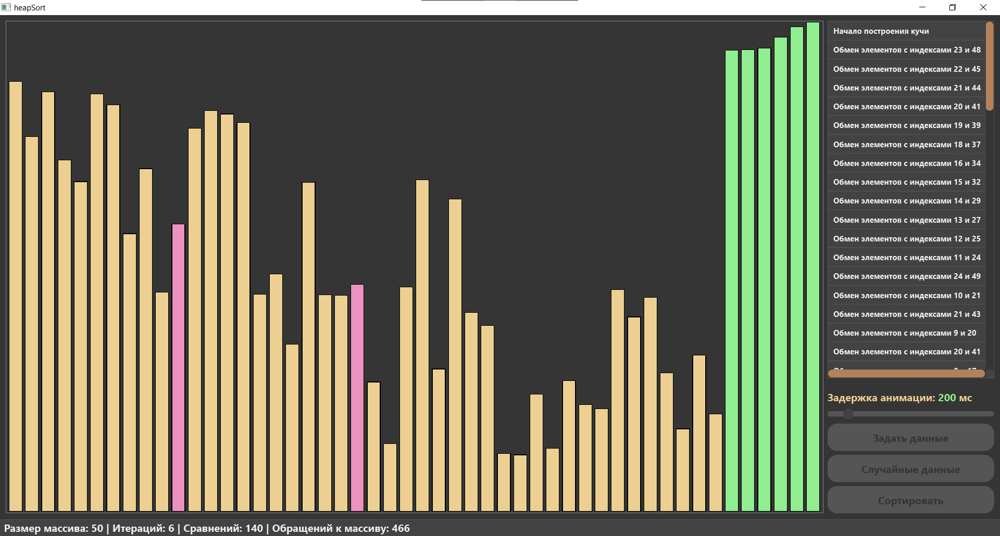
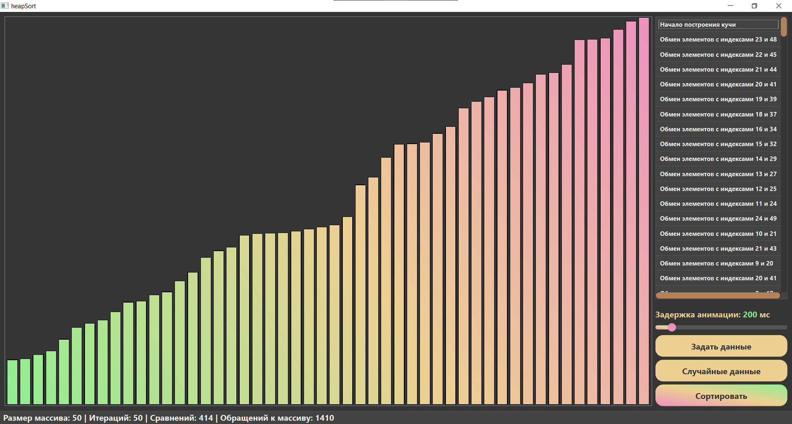

# Визуализация Пирамидальной Сортировки

[English](README.md) | Русский

Приложение на Qt, которое визуализирует работу алгоритма пирамидальной сортировки (Heap Sort). Наблюдайте, как алгоритм преобразует неотсортированный массив в бинарную кучу, а затем сортирует его!

## Визуализация Алгоритма

### Процесс Сортировки

### Конечный Результат

## Возможности

- Визуальное представление алгоритма пирамидальной сортировки
- Пошаговая визуализация с настраиваемой скоростью
- Статистика в реальном времени:
  - Размер массива
  - Количество итераций
  - Количество сравнений
  - Количество обращений к массиву
- Цветовая кодировка:
  - Красный: Сравниваемые/обмениваемые элементы
  - Зелёный: Отсортированные элементы
  - Синий: Текущие элементы массива

## Управление

- Генерация нового массива со случайными значениями
- Настройка размера массива
- Управление скоростью визуализации
- Запуск/Остановка сортировки
- Сброс визуализации

## Технические Детали

Проект состоит из трёх основных компонентов:
- `HeapSort`: Реализация алгоритма сортировки
- `HeapSortView`: Визуальное представление массива
- `MainWindow`: Пользовательский интерфейс и элементы управления

### Реализация Алгоритма
Реализация следует классическому подходу пирамидальной сортировки:
1. Построение максимальной кучи из массива
2. Последовательное извлечение максимального элемента
3. Размещение его в конце массива

## Сборка

### Требования
- Qt 5.x или выше
- Компилятор C++ с поддержкой C++11
- CMake (опционально)

### Шаги Сборки
1. Откройте `heapSort.pro` в Qt Creator
2. Настройте проект
3. Соберите и запустите

## Использование

1. Запустите приложение
2. Используйте "Сгенерировать" для создания нового случайного массива
3. При необходимости настройте скорость сортировки
4. Нажмите "Старт" для начала визуализации
5. Наблюдайте за магией!

## Лицензия
Этот проект предоставляется как есть в образовательных целях.
