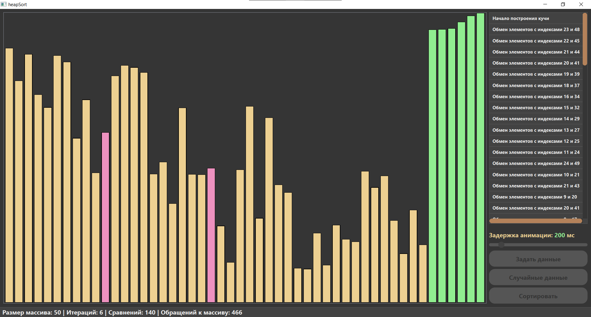

# HeapSort Visualization

English | [Русский](README-RU.md)

A Qt-based application that visualizes the Heap Sort algorithm in action. Watch how the algorithm transforms an unsorted array into a binary heap and then sorts it!

## Algorithm Visualization

### Sorting Process

### Final Result

## Features

- Visual representation of Heap Sort algorithm
- Step-by-step visualization with customizable speed
- Real-time statistics:
  - Array size
  - Number of iterations
  - Number of comparisons
  - Array access count
- Color coding:
  - Red: Elements being compared/swapped
  - Green: Sorted elements
  - Blue: Current array elements

## Controls

- Generate new array with random values
- Adjust array size
- Control visualization speed
- Start/Stop sorting
- Reset visualization

## Technical Details

The project consists of three main components:
- `HeapSort`: Core sorting algorithm implementation
- `HeapSortView`: Visual representation of the array
- `MainWindow`: User interface and controls

### Algorithm Implementation
The implementation follows the classical Heap Sort approach:
1. Build max heap from array
2. Repeatedly extract maximum element
3. Place it at the end of the array

## Building

### Requirements
- Qt 5.x or higher
- C++ compiler with C++11 support
- CMake (optional)

### Build Steps
1. Open `heapSort.pro` in Qt Creator
2. Configure project
3. Build and run

## Usage

1. Launch the application
2. Use "Generate" to create a new random array
3. Adjust the sorting speed if needed
4. Click "Start" to begin visualization
5. Watch the magic happen!

## License
This project is provided as-is for educational purposes.
